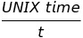
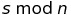
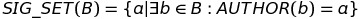
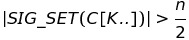
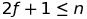

## Simple Summary
Aura is a basic consensus algorithm where only a defined set of users is able to _mine_ blocks.

## Abstract
Aura (_Authority Round_) is a proof-of-authority blockchain consensus algorithm where only a defined set of validators is allowed to seal blocks. It's a protocol where instead of miners racing to find a solution to a difficult problem, authorized signers can create new blocks in a round-robin process at defined intervals.

Aura is the consensus engine pioneered by [Parity Technologies](https://parity.io) in 2016 and used to power the [public Kovan testnet](https://medium.com/@Digix/announcing-kovan-a-stable-ethereum-public-testnet-10ac7cb6c85f) which was established after the [Ropsten spam-attacks](https://ethereum.stackexchange.com/questions/12477/ropsten-testnet-is-under-kind-of-attack-what-can-we-do) in 2017. In addition, public value-bearing networks, such as [POA Network](https://poa.network/), are based on the Aura protocol today.

This document is _informational_ to summarize all available technical specification of the consensus engine to allow other client developer teams an overview, a place for feedback, and potentially the foundation to implement this in other code bases.

## Motivation

## Specification
The following technically specifies the Authority Round consensus protocol.

#### Parameters
  - `n`, the number of nodes
  - `f`, the number of faulty nodes
  - `t`, the step duration in seconds

#### Description
Time is divided into discrete steps of duration `t`, determined by:

At each step `s`, a _primary_ will be assigned. Only the primary at a step may issue a block. It is misbehavior to produce more than one block per step or to produce a block out of turn.

The primary for a step `s` is the node with index:

The protocol contains a chain scoring rule `SCORE(C)` for a given chain `C`.

On each step, each honest node will propagate the chain with the highest score it knows about to all other nodes. Honest primaries will only issue blocks on top of the best chain they are aware of during their turn.

#### Finality
Under the assumption of a synchronous network which propagates messages within the step duration `t`, let `SIG_SET(B)` be the set of signatures from all authors in the set of blocks `B`:

If there is a valid chain `C` ending with `C[K..]`, where:

then `C[K]` and all of its ancestors are finalized.

This definition of finality stems from a simple majority vote. In this setting:

so the faulty nodes cannot finalize a block all on their own.

#### Empty steps
In order to reach finality in a timely fashion it is necessary for the nodes to keep sealing blocks even when there are no transactions. To reduce blockchain bloat while still maintaining the same finality guarantees the nodes can sign and broadcast an `EmptyStep(step, parent_hash)` message instead of producing an empty block. All of the nodes accumulate the broadcasted empty step messages and they are included and rewarded in the next non-empty block.

The empty step messages included in blocks are also taken into account for finality.

To enable empty step messages set the `emptyStepsTransition` to enable it at the given block number. You can also specify a maximum number of empty steps with `maximumEmptySteps` in your chain spec.

#### Node Configuration
This consensus requires a [`ValidatorSet`](Validator-Set.md) to be specified, which determines the list of `n` blockchain addresses at each height `h` which participate in the consensus.

A node can represent a validator when it is run with `--engine-signer VALIDATOR-ADDRESS`.

The consensus can be run with `--force-sealing` which ensures that blocks are produced even if there are no transactions. This is necessary for blocks to reach finality in a timely fashion.

#### Wishlist
- Apply step backoff after skipping primaries, not before. Exponential backoff may allow for weakly synchronous network without failure.
- Faster finality by broadcasting signed `GOOD(Hash)` messages where Hash is a block hash of a block with number multiple of some epoch length. `GOOD` messages can be included in the seal.

## Rationale
The rationale fleshes out the specification by describing what motivated the design and why particular design decisions were made. It should describe alternate designs that were considered and related work, e.g. how the feature is supported in other languages. The rationale may also provide evidence of consensus within the community, and should discuss important objections or concerns raised during discussion.-->

## Backwards Compatibility
All EIPs that introduce backwards incompatibilities must include a section describing these incompatibilities and their severity. The EIP must explain how the author proposes to deal with these incompatibilities. EIP submissions without a sufficient backwards compatibility treatise may be rejected outright.

## Test Cases
Test cases for an implementation are mandatory for EIPs that are affecting consensus changes. Other EIPs can choose to include links to test cases if applicable.

## Implementation
The implementations must be completed before any EIP is given status "Final", but it need not be completed before the EIP is accepted. While there is merit to the approach of reaching consensus on the specification and rationale before writing code, the principle of "rough consensus and running code" is still useful when it comes to resolving many discussions of API details.

## Copyright
Copyright and related rights waived via [CC0](https://creativecommons.org/publicdomain/zero/1.0/).
